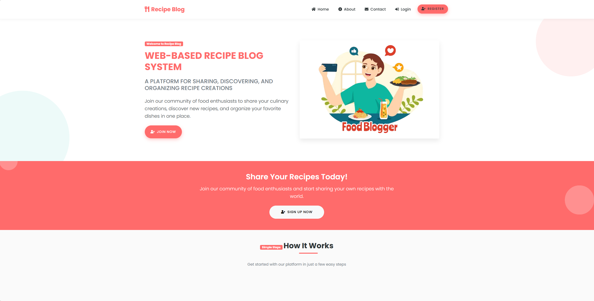

# 🥗 WEB-BASED RECIPE BLOG SYSTEM

[](https://github.com/Ak1ero/Python-Project/actions) 
[](LICENSE) 
[](CONTRIBUTING.md)

A platform for sharing, discovering, and organizing recipe creations.

---

## 📋 Table of Contents
- [Project Overview](#project-overview)
- [Features](#features)
- [Current Status](#current-status)
- [Setup Instructions](#setup-instructions)
- [Project Structure](#project-structure)
- [Technologies Used](#technologies-used)
- [Screenshots](#screenshots)
- [Contributing](#contributing)
- [License](#license)

---

## 📝 Project Overview
This is a web-based recipe blog system built with **Flask** that allows users to share recipes, discover new dishes, and organize their culinary creations.

## ✨ Features
- 👤 User authentication (register, login, profile management)
- 📝 Recipe creation, editing, and deletion
- 🏷️ Recipe categorization and tagging
- 🔍 Recipe search and filtering
- ⭐ User favorites and collections
- 💬 Comments and ratings on recipes
- 📱 Responsive design for all devices

## 🚦 Current Status
- Home page
- About page
- Contact page
- Basic styling and UI elements

## ⚙️ Setup Instructions
1. **Clone this repository:**
   ```sh
   git clone https://github.com/Ak1ero/Python-Project.git
   ```
2. **Create a virtual environment and activate it:**
   ```sh
   python -m venv venv
   venv\Scripts\activate  # Windows
   source venv/bin/activate  # Linux/Mac
   ```
3. **Install the required dependencies:**
   ```sh
   pip install -r requirements.txt
   ```
4. **Run the Flask application:**
   ```sh
   python app.py
   ```
5. **Open your browser and navigate to:**
   ```
   http://localhost:5000
   ```

## 📁 Project Structure
```
├── app.py                # Main Flask application file
├── templates/            # HTML templates
├── static/               # Static files (CSS, JS, images)
│   ├── css/              # Stylesheets
│   ├── js/               # JavaScript files
│   └── images/           # Image files
```

## 🛠️ Technologies Used
- Flask (Python web framework)
- Bootstrap (Front-end framework)
- MySQL (Database)
- HTML/CSS/JavaScript

## 📸 Screenshots

*Recipe Blog homepage showing the main landing page with navigation and hero section*

---

## 🤝 Contributing
Contributions are welcome! Please open issues or submit pull requests for improvements.